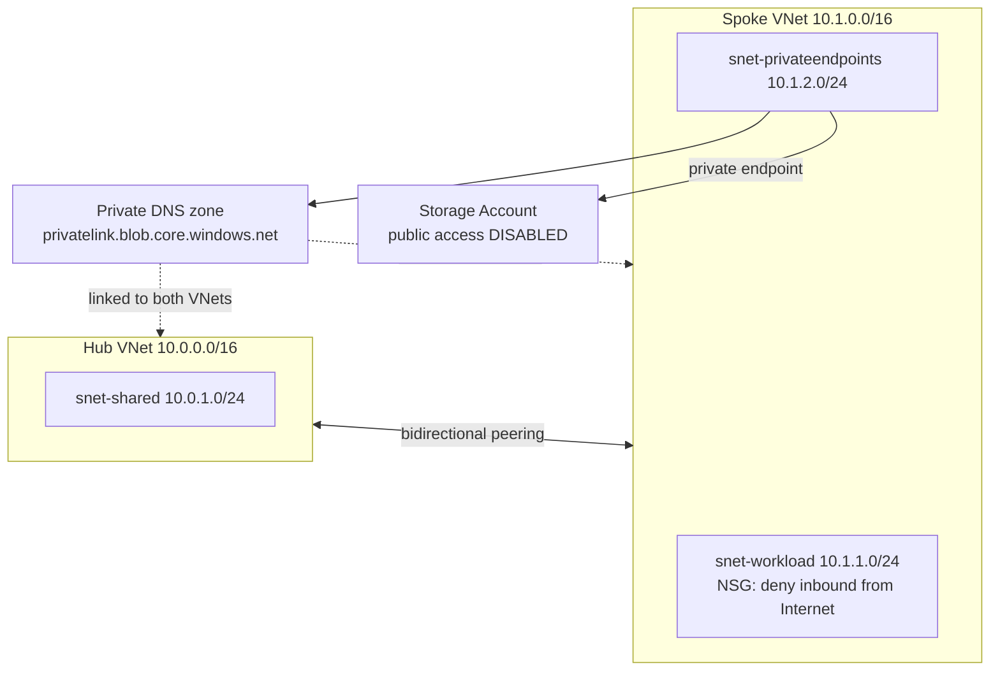
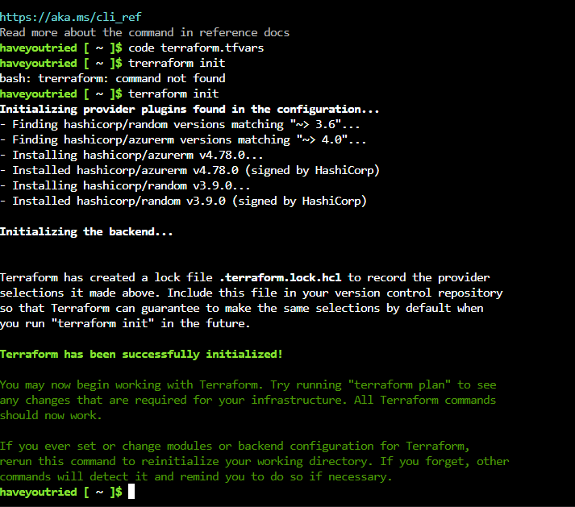
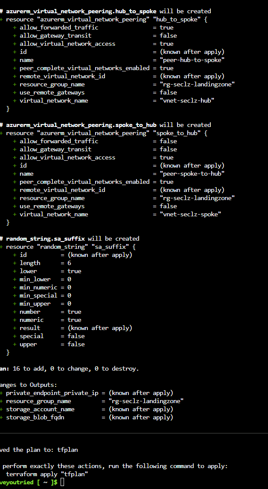
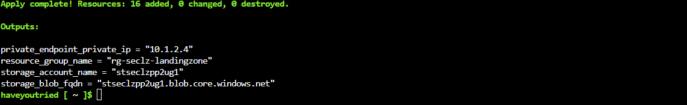
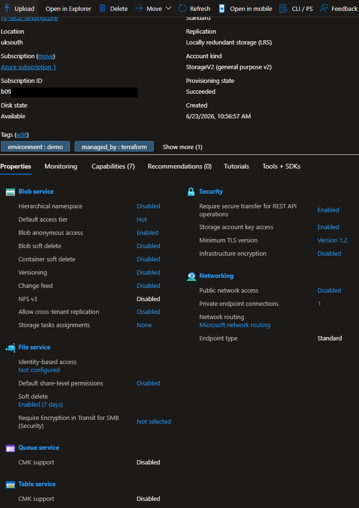
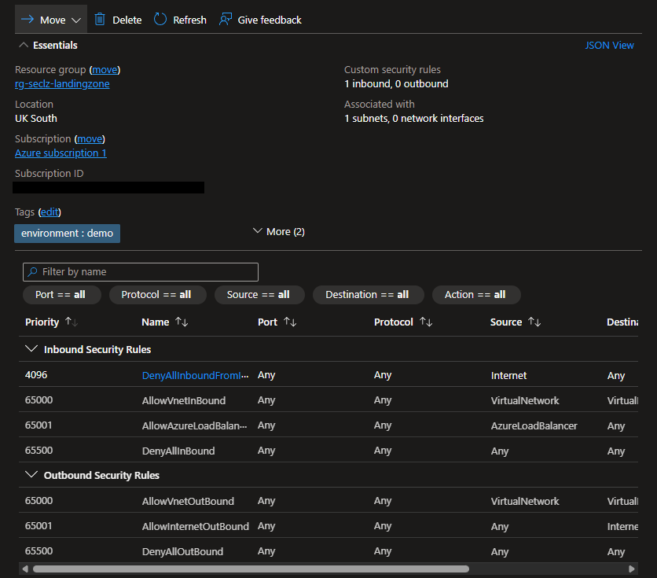
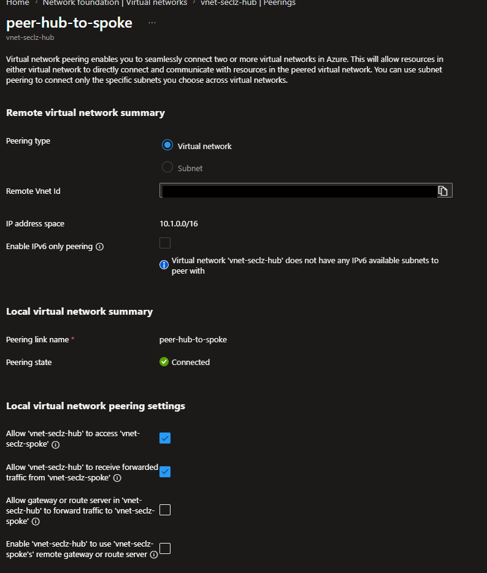
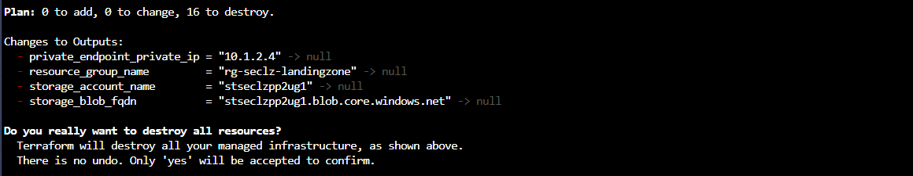

# Azure Secure Landing Zone (Terraform)

A small, deliberately security-first Azure landing zone built with Terraform. It
demonstrates the network and data controls at the core of the Microsoft **SC-500
(Cloud and AI Security Engineer Associate)** exam, and is designed to be deployed,
verified, screenshotted, and destroyed in a single short session to keep cost near zero.

> Built and verified end-to-end in Azure: 16 resources deployed cleanly, controls
> confirmed in the portal, then torn down. Evidence screenshots are in
> [`docs/screenshots`](docs/screenshots).

## Architecture



**What it builds**

- Hub and spoke VNets with **bidirectional peering**
- A workload subnet protected by an **NSG that explicitly denies inbound internet**
- A **hardened storage account**: public endpoint off, anonymous access off, shared-key
  auth off (Entra ID only), and infrastructure encryption on
- A **private endpoint** for blob storage in a dedicated subnet
- A **private DNS zone** linked to both VNets, so the storage FQDN resolves to a private IP

## Mapping to SC-500 exam domains

| Control in this repo | What it demonstrates |
|---|---|
| NSG with explicit internet deny on the workload subnet | Network security / zero-trust segmentation |
| Hub-and-spoke topology with peering | Secure network design and isolation |
| Storage `public_network_access_enabled = false` | Data/storage security; reducing attack surface |
| Anonymous + shared-key access disabled | Identity-based (Entra ID) data plane auth; least privilege |
| Private endpoint + private DNS zone | Private connectivity to PaaS; eliminating public exposure |
| Tagging + IaC + gitignored secrets | Governance and secure configuration management |

## Defence-in-depth on the storage account

Disabling the public endpoint locks the front door, but it is not the whole story. This
account also has:

- `allow_nested_items_to_be_public = false` — blocks anonymous blob access at the account level
- `shared_access_key_enabled = false` — forces **Entra ID (RBAC)** authentication; no account keys
- `infrastructure_encryption_enabled = true` — a second encryption layer at rest

Trade-off to be aware of: with shared-key access disabled, any data-plane operation needs
an Entra ID role such as *Storage Blob Data Owner* — which is the intended, least-privilege
posture rather than handing out account keys.

## Deploy

Everything runs from **Azure Cloud Shell** — Terraform is pre-installed, so there's
nothing to set up locally and no VM required.

```bash
az account show --query id -o tsv          # get your subscription ID
cp terraform.tfvars.example terraform.tfvars
#  edit terraform.tfvars and paste in your subscription_id
terraform init
terraform plan -out=tfplan
terraform apply tfplan
```

| Init | Plan | Apply |
|---|---|---|
|  |  |  |

## Verify (the portfolio evidence)

After `apply`, confirm and capture each control:

```bash
nslookup $(terraform output -raw storage_blob_fqdn)
# returns the PRIVATE 10.1.x.x endpoint address, proving private DNS resolution
```

**Storage account — public network access disabled**



**Workload NSG — explicit deny on inbound internet (priority 4096)**



**Hub-to-spoke peering — Connected**



## Destroy

```bash
terraform destroy
```



Tearing down what you build keeps cost near zero and is a deliberate cost-discipline habit.

## Cost

The only meaningfully metered component is the **private endpoint** (a few pence per hour).
VNets, subnets, peering, NSGs, an empty storage account, and a private DNS zone are free or
near-free. A deploy-verify-destroy session costs pennies.

> If you extend this, watch the big-ticket items: **Azure Firewall** and **Azure Bastion**
> cost real money per hour and should never be left running on a credit budget.

## What I'd do differently in production

- Remote state in an Azure Storage backend with state locking, not local state
- Centralised egress through Azure Firewall in the hub, with UDRs forcing spoke traffic through it
- Azure Policy to *enforce* "no public storage" tenant-wide, rather than per-resource settings
- Customer-managed keys in Key Vault for storage encryption
- Diagnostic settings shipping logs to Log Analytics / Microsoft Sentinel

## Roadmap

- **Phase 1–2 (this repo):** secure network + hardened private storage
- **Phase 3:** Key Vault + managed identity (zero hardcoded secrets)
- **Phase 4:** Microsoft Defender for Cloud, capture secure score
- **Phase 5:** AI slice — secure an Azure OpenAI deployment with managed identity + Purview DLP
